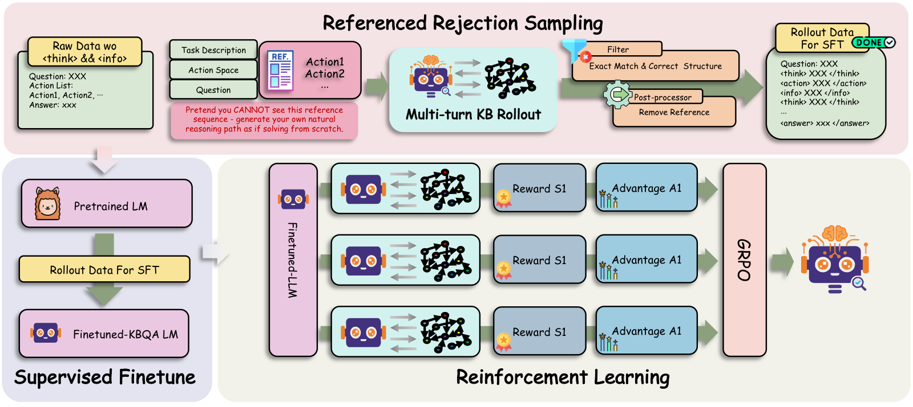

# [ICML 2026]KBQA-R1: Reinforcing Large Language Models for Knowledge Base Question Answering

[](LICENSE)

This repository contains the official implementation of **KBQA-R1**, an action-centric reinforcement learning framework for Knowledge Base Question Answering (KBQA). KBQA-R1 treats KBQA as a multi-turn Markov Decision Process (MDP) and optimizes the policy using Group Relative Policy Optimization (GRPO) with outcome-based rewards.

<p align="center">
  
</p>

## Key Features

- **Action-Centric Design**: Operates within a well-defined action space (Find_Relation, Merge, Order, Compare, Time_Constraint, Count, Finish)
- **Referenced Rejection Sampling (RRS)**: Novel data synthesis strategy for high-quality SFT warm-start
- **GRPO Optimization**: Outcome-based RL with low-variance advantage estimation
- **Multi-Dataset Support**: WebQSP, GrailQA, and GraphQ datasets

## Installation

```bash
# Clone the repository
git clone https://github.com/your-username/kbqa-r1.git
cd kbqa-r1

# Create conda environment
conda create -n kbqa-r1 python=3.10 -y
conda activate kbqa-r1

# Install dependencies
pip install -r requirements.txt

# Install verl (RL framework)
pip install -e .
```

### Requirements

- Python 3.10+
- PyTorch 2.0+
- 8× NVIDIA A100/H100 GPUs (80GB) for training
- Freebase SPARQL endpoint (Virtuoso)
- unixodbc (`sudo apt install unixodbc unixodbc-dev`)

### Freebase Virtuoso Setup

Follow the [Freebase-Setup](https://github.com/dki-lab/Freebase-Setup) instructions:

```bash
# 1. Clone Freebase-Setup
git clone https://github.com/dki-lab/Freebase-Setup.git
cd Freebase-Setup

# 2. Download Virtuoso DB (WARNING: 53G+ disk space needed)
wget https://www.dropbox.com/s/q38g0fwx1a3lz8q/virtuoso_db.zip
tar -zxvf virtuoso_db.zip

# 3. Start Virtuoso service (requires ~100GB RAM)
chmod +x virtuoso-opensource/bin/virtuoso-t
python3 scripts/virtuoso.py start 3001 -d virtuoso_db

# 4. Download Freebase ontology files to dataset/Freebase/
# fb_roles, fb_types, reverse_properties from:
# https://github.com/dki-lab/GrailQA/tree/main/ontology
```

**ODBC Configuration** (`/etc/odbcinst.ini`):
```ini
[Virtuoso]
Description = Virtuoso ODBC Driver
Driver = /path/to/virtuoso-opensource/lib/virtodbc_r.so
Setup = /path/to/virtuoso-opensource/lib/virtodbc_r.so
FileUsage = 1
```

## Data Preparation

### Dataset Format

We use the data processing pipeline from [KBQA-o1](https://github.com/LHRLAB/KBQA-o1) to prepare the datasets. Please follow their instructions to generate the processed data with S-Expressions and function lists.

The processed data should follow this format:

```json
{
  "ID": "WebQSP-train-001",
  "question": "What team did Kaká play for in 2009?",
  "answer": ["m.0cxgc"],
  "sexpr": "(AND (JOIN sports.pro_athlete.teams ...) ...)",
  "function_list": [
    "expression0 = START('m.04qv66')",
    "expression1 = JOIN('sports.pro_athlete.teams', expression0)",
    "..."
  ]
}
```

### Prepare RL Dataset

```bash
python scripts/data_process/prepare_rl_dataset.py \
    --data_path dataset/WebQSP/processed/WebQSP_train.json \
    --dataset webqsp \
    --use_odbc  # Optional: use ODBC for entity label lookup
```

## Training Pipeline

KBQA-R1 uses a 4-stage training pipeline:

### Stage 1: Referenced Rejection Sampling (RRS)

Generate high-quality trajectories using a stronger model (e.g., Qwen2.5-72B):

```bash
# Step 1: Prepare rejection sampling dataset (add action hints)
bash scripts/data_process/prepare_all_rejection_sampling_datasets.sh

# Step 2: Run rejection sampling
export DATASET_TYPE=webqsp  # or grailqa, graphq
export MODEL_PATH=/path/to/Qwen2.5-72B-Instruct
bash scripts/data_process/rejection_sampling_simple.sh
```

### Stage 2: Build SFT Dataset

Convert rejection sampling outputs to SFT format:

```bash
bash scripts/data_process/run_build_sft_from_dumps.sh
```

### Stage 3: Supervised Fine-tuning (SFT)

Warm-start the policy with SFT on the distilled trajectories:

```bash
export BASE_MODEL=/path/to/Llama-3.1-8B-Instruct
export DATASET_TYPE=webqsp

bash scripts/train/run_sft_from_rejection.sh
```

### Stage 4: Reinforcement Learning (GRPO)

Optimize the policy with GRPO:

```bash
export DATASET_TYPE=webqsp
export USE_SFT_MODEL=true  # Use SFT checkpoint as base

bash scripts/train/train_kbqa_sexpr_generation_grpo.sh
```

## Project Structure

```
kbqa-r1/
├── kbqa_r1/                    # Core KBQA modules
│   ├── llm_agent/              # LLM agent and S-Expression generation
│   ├── sexpr/                  # S-Expression parsing and execution
│   └── sparql/                 # SPARQL execution and conversion
├── verl/                       # VERL RL training framework
├── scripts/
│   ├── data_process/           # Data preparation scripts
│   │   ├── rejection_sampling_simple.sh
│   │   ├── run_build_sft_from_dumps.sh
│   │   ├── build_sft_from_dumps.py
│   │   └── prepare_rl_dataset.py
│   ├── train/                  # Training scripts
│   │   ├── run_sft_from_rejection.sh
│   │   └── train_kbqa_sexpr_generation_grpo.sh
│   └── evaluate.sh             # Evaluation script
└── examples/                   # Example data files
```


## License

This project is licensed under the Apache License 2.0 - see the [LICENSE](LICENSE) file for details.

## Acknowledgments

- [VERL](https://github.com/volcengine/verl) - Volcano Engine Reinforcement Learning framework
- [Search-R1](https://github.com/PeterGriffinJin/Search-R1) - Inspiration for agentic RL training
- [KBQA-o1](https://github.com/LHRLAB/KBQA-o1) - Data processing pipeline and action space definition.
- [Freebase](https://developers.google.com/freebase) - Knowledge Base
